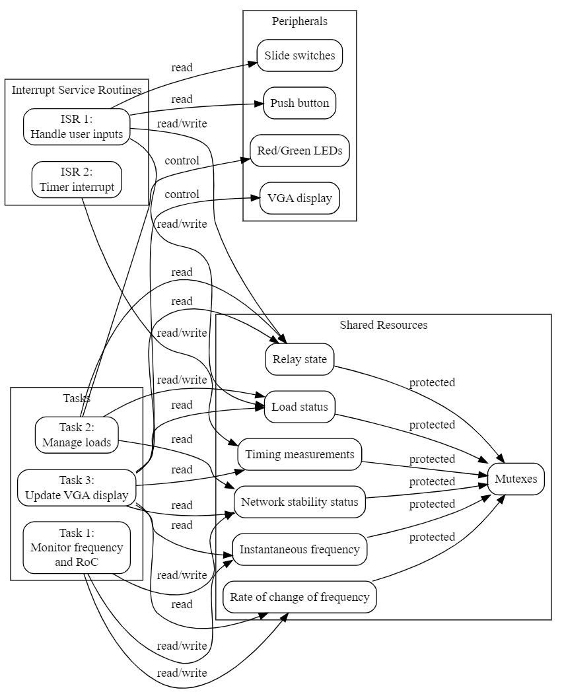

# LCFR

Visit the [Assignment page](https://thiagosoutogit.github.io/ProgrammingOracle/Pages/Embedded/Assignment-1.html#takes-from-assignment-1-brief) for the complete documentation on the development of the software.

Here is an overview of the system





## Task 1

Task 1 (Monitor frequency and RoC): Measures the instantaneous frequency and the rate of change of frequency. The frequency is measured using an external frequency analyzer, and the rate of change is calculated based on time intervals. The network stability is then determined based on the measured frequency and rate of change.

```c
void task1(void *pvParameters) {
    // Variables for frequency measurement and rate of change calculation
    float prev_freq = 0;
    float curr_freq = 0;
    float prev_time = 0;
    float curr_time = 0;
    float measured_inst_freq;
    float measured_roc_freq;

    while (1) {
        printf("Task 1 - Frequency measurement: \n");
        // Measure inst_freq using appropriate sensors or methods
        measured_inst_freq = IORD(FREQUENCY_ANALYSER_BASE, 0);
        printf("%f Hz\n", 16000 / (double)measured_inst_freq);

        // Calculate rate of change of frequency in Hz/s
        curr_time = xTaskGetTickCount() * portTICK_PERIOD_MS / 1000.0; // Convert ms to s
        curr_freq = measured_inst_freq;
        if (curr_time != prev_time) { // Check if the time interval is not zero
            measured_roc_freq = (curr_freq - prev_freq) / (curr_time - prev_time);
        } else {
            measured_roc_freq = 0; // Set rate of change to 0 if time interval is zero
        }
        prev_freq = curr_freq;
        prev_time = curr_time;

        printf("Task 1 - Rate of frequency change: \n");
        printf("%f Hz\n", (double)measured_roc_freq);

        // Update shared resources
        xSemaphoreTake(xMutex, portMAX_DELAY);
        inst_freq = measured_inst_freq;
        roc_freq = measured_roc_freq;
        net_stability = (inst_freq >= THRESHOLD_FREQ) && (abs(roc_freq) <= THRESHOLD_ROC);
        xSemaphoreGive(xMutex);

        // Sleep for a while (adjust the delay as needed)
        vTaskDelay(pdMS_TO_TICKS(100));
    }
}
```

## Task 2

Task 2 (Manage loads): Manages loads based on the network stability and relay state. The loads can be managed by controlling their states (e.g., turning them on or off). The task also updates LED states according to the load status and relay state.

```c
void task2(void *pvParameters) {
    while(1) {
        // Check network stability and relay state
        xSemaphoreTake(xMutex, portMAX_DELAY);
        int net_stability_local = net_stability;
        int relay_state_local = relay_state;
        xSemaphoreGive(xMutex);

        // Perform load shedding or reconnection based on the network stability, priority, and relay state
        for (int i = 0; i < MAX_LOADS; i++) {
            if (load_priority[i] == PRIORITY_HIGH && net_stability_local == 0) {
                load_status[i] = 0; // shed high priority load if network is unstable
            } else if (load_priority[i] == PRIORITY_LOW && relay_state_local == 0) {
                load_status[i] = 0; // shed low priority load if relay is off
            } else {
                load_status[i] = 1; // reconnect load if conditions are met
            }
        }

        // Update LED states according to load status and relay state
        for (int i = 0; i < MAX_LOADS; i++) {
            // Set LED state according to load status
            if (load_status[i] == 1) {
                IOWR_ALTERA_AVALON_PIO_DATA(GREEN_LEDS_BASE, (1 << i));
            } else {
                IOWR_ALTERA_AVALON_PIO_DATA(GREEN_LEDS_BASE, ~(1 << i));
            }
        }

        // Sleep for a while (adjust the delay as needed)
        vTaskDelay(pdMS_TO_TICKS(100));

        // Print load status
        printf("Task 2 - Manage Loads: \n");
		for (int i = 0; i < MAX_LOADS; i++) {
			printf("Load %d = %d\n", i + 1, load_status[i]);
		}

        // Sleep for a while (adjust the delay as needed)
		vTaskDelay(pdMS_TO_TICKS(1000));
    }
}
```

## Task 3

Task 3 (Update VGA display): Reads shared variables and updates the VGA display with the frequency and relay information.

```c
void task3(void *pvParameters) {
    alt_up_pixel_buffer_dma_dev *pixel_buf;
    pixel_buf = alt_up_pixel_buffer_dma_open_dev(VIDEO_PIXEL_BUFFER_DMA_NAME);
    if (pixel_buf == NULL) {
        printf("Cannot find pixel buffer device\n");
    }
    alt_up_pixel_buffer_dma_clear_screen(pixel_buf, 0);

    alt_up_char_buffer_dev *char_buf;
    char_buf = alt_up_char_buffer_open_dev("/dev/video_character_buffer_with_dma");
    if (char_buf == NULL) {
        printf("can't find char buffer device\n");
    }

    // Blink LED for Task 3
    IOWR_ALTERA_AVALON_PIO_DATA(LED_TASK3_BASE, 0x1);
    vTaskDelay(pdMS_TO_TICKS(100));
    IOWR_ALTERA_AVALON_PIO_DATA(LED_TASK3_BASE, 0x0);
    vTaskDelay(pdMS_TO_TICKS(100));

    char freq_text[20];
    char roc_text[20];
    char mode_status_text[20];
    char load_status_text[MAX_LOADS][20];

    while (1) {
        // Read shared variables
        xSemaphoreTake(xMutex, portMAX_DELAY);
        float inst_freq_local = inst_freq;
        float roc_freq_local = roc_freq;
        int relay_state_local = relay_state;
        int load_status_local[MAX_LOADS];
        for (int i = 0; i < MAX_LOADS; i++) {
            load_status_local[i] = load_status[i];
        }
        xSemaphoreGive(xMutex);

        // Clear lines before updating VGA display with frequency, rate of change, mode, and load status information
        for (int i = 0; i < (MAX_LOADS + 3); i++) {
            custom_char_buffer_clear_line(char_buf, 30 + i);
        }

        // Update VGA display with frequency and rate of change information
        snprintf(freq_text, sizeof(freq_text), "Frequency: %.2f Hz", 16000 / (double)inst_freq_local);
        alt_up_char_buffer_string(char_buf, freq_text, 40, 30);
        snprintf(roc_text, sizeof(roc_text), "RoC: %.2f Hz/s", roc_freq_local);
        alt_up_char_buffer_string(char_buf, roc_text, 40, 32);

        // Update VGA display with mode status information
        snprintf(mode_status_text, sizeof(mode_status_text), "Mode: %s", relay_state_local ? "Maintenance" : "Normal");
        alt_up_char_buffer_string(char_buf, mode_status_text, 40, 34);

        // Update VGA display with load status information
        for (int i = 0; i < MAX_LOADS; i++) {
            snprintf(load_status_text[i], sizeof(load_status_text[i]), "Load %d: %s", i + 1, load_status_local[i] ? "ON" : "OFF");
            alt_up_char_buffer_string(char_buf, load_status_text[i], 40, 36 + i);
        }

        vTaskDelay(pdMS_TO_TICKS(1000));
    }
}
```


## ISR 1

ISR 1 handles user inputs:

Detect slide switch position changes and update the corresponding load status.
Detect push button press to toggle the relay state between normal and maintenance.
Use mutexes for accessing shared resources to ensure mutual exclusion.

```c
void ISR1(void *context, alt_u32 id) {
    // Handle user input (slide switches and push button)
    alt_u32 slide_switches_value = IORD_ALTERA_AVALON_PIO_EDGE_CAP(SLIDE_SWITCH_BASE);
    alt_u32 push_button_value = IORD_ALTERA_AVALON_PIO_EDGE_CAP(PUSH_BUTTON_BASE);

    // Reset edge capture registers
    IOWR_ALTERA_AVALON_PIO_EDGE_CAP(PUSH_BUTTON_BASE, 0x0);
    IOWR_ALTERA_AVALON_PIO_IRQ_MASK(PUSH_BUTTON_BASE, 0x2);

    // Update shared resources (load_status and relay_state)
    xSemaphoreTakeFromISR(xMutex, 0);

    // Update relay_state based on the push button KEY1
    if (push_button_value & 0x2) { // Changed from 0x1 to 0x2 to use KEY1
        printf("ISR 1 - Changing the relay state: \n");
        printf("relay state: %s.\n", relay_state ? "Maintenance" : "Normal");
    	relay_state = !relay_state;
    	printf("ISR 1 - relay state after the change: \n");
		printf("relay state: %s.\n", relay_state ? "Maintenance" : "Normal");
    }

    // Update load_status based on the slide switches only when the relay state is in maintenance
    if (relay_state == 1) {
        for (int i = 0; i < MAX_LOADS; i++) {
            if (slide_switches_value & (1 << i)) {
                load_status[i] = !load_status[i];
            }
        }
    }

    xSemaphoreGiveFromISR(xMutex, 0);
}
```